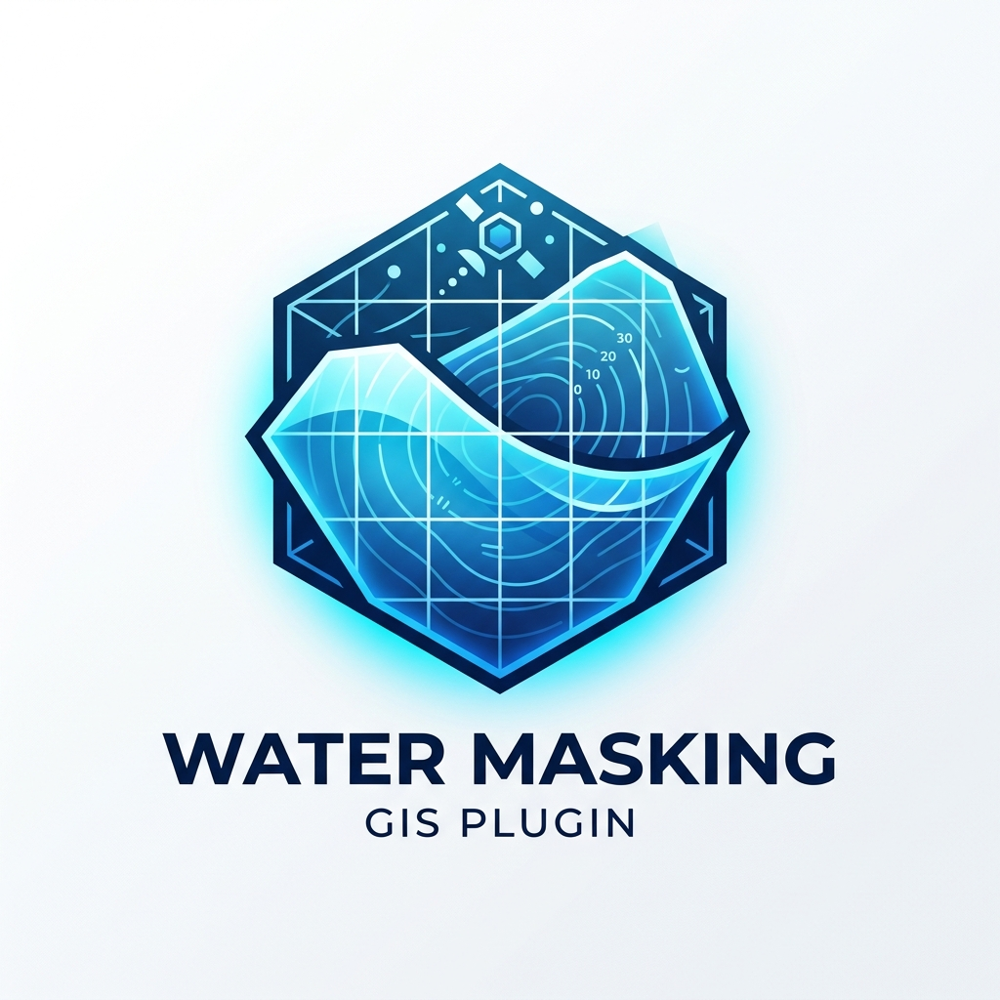

<table>
<tr>
<td>

</td>
<td>

**Water Masking Plugin: Advanced Waterbody Extraction**

</td>
</tr>
</table>

**Water Masking Plugin** is a specialized QGIS toolkit designed to extract accurate water masks and generate smoothed waterbody polygons from multispectral satellite imagery.
The tool automatically computes the indices NDVI, MNDWI, and NWI and leverages them to isolate water bodies effectively while eliminating noise and sharp edges.

🔬 **Scientific Methodology**
The toolkit follows a structured workflow to ensure accurate water extraction and smooth polygons.

**Phase 1: Indices Calculation**

The tool calculates key water indices using the provided bands (Blue, Green, Red, NIR, SWIR):
**NDVI (Normalized Difference Vegetation Index):** (NIR - Red) / (NIR + Red)
**MNDWI (Modified Normalized Difference Water Index):** (Green - SWIR) / (Green + SWIR)
**NWI (New Water Index):** (VisMean - IRMean) / (VisMean + IRMean)

***Key References:***  
- **Xu, H. (2006):** Modification of normalised difference water index (MNDWI) to enhance open water features.  
- **Rouse et al. (1974):** Normalized Difference Vegetation Index (NDVI).

**Phase 2: Water Masking Equation**

The waterbody polygon is extracted using the following hybrid decision-tree equation:
`(MNDWI > 0) AND (NWI > 0) AND (NDVI < 0.1)`

*Why this combination?*
- **MNDWI > 0**: The primary detector for open water.
- **NWI > 0**: Acts as a secondary check to eliminate false positives from dark urban areas and terrain shadows.
- **NDVI < 0.1**: Filters out dense aquatic vegetation, algal blooms, and wetlands, ensuring only pure water pixels are vectorized.

**Phase 3: Noise Removal & Smoothing**

**Sieve Filter:** Removes isolated noise pixels.
**Geometry Smoothing:** Rounds the sharp stair-step edges of the final polygon.

📧 ***Contact & Citation***

**Author:** Mohamed Aly Nasef
**Email:** Eng.m.nasef2017@gmail.com, Nasefm.aly@alexu.edu.eg

🤖 **AI Acknowledgment**
The development of the Water Masking Plugin code, its logical structure, and the technical documentation were significantly enhanced and optimized using Google Gemini. The AI assisted in debugging complex workflows and ensuring the implementation follows best practices in geospatial data science.
